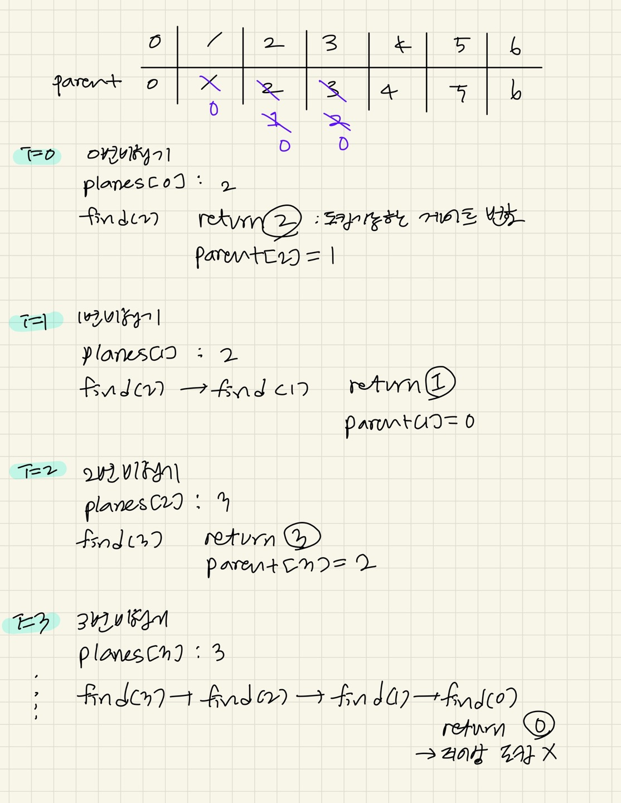

### 문제풀이

1. 비행기를 순차적으로 도킹할때, 해당 순서의 비행기를 가능한 가장 높은 게이트에 도킹해야한다. 
2. union-find를 활용해 빠르게 빈 게이트를 찾는다. 
- parent[x]===x 일때 x번게이트에 도킹가능하다. 
- parent[x]!==x 일때, parent[x]의 parent를 거슬러올라가면서 도킹가능한 가장 가까운 게이트를 찾는다. 
3. 도킹할 수 없을 때 종료한다. 
