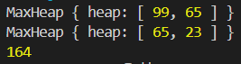

### 문제풀이
우선순위 큐<br/>

### 우선순위 큐
큐(Queue)는 먼저 들어오는 데이터가 먼저 나가는 FIFO(First In First Out) 형식의 자료구조이다.<br/>
우선순위 큐는 먼저 들어오는 데이터가 아니라, 우선순위 가 높은 데이터가 먼저 나가는 형태의 자료구조이다.<br/>
`우선순위 큐`는 일반적으로 `Heap(힙)`을 이용하여 구현한다.<br/>

### 힙?

힙은 완전 이진 트리 형태로 트리기반의 자료구조이다. 우선순위 큐를 구현할 때 자주 사용되고, 힙에는 크게 두 종류가 있다.<br/>

1. 최대힙<br/>
2. 최소힙<br/>
   **힙의 특징**<br/>

- 완전 이진 트리 : 모든 노드가 `왼쪽에서 오른쪽으로 차례대로 채워지는` 성질<br/>
- `부모노드`와 `서브트리`간 `대소 관계`가 성립된다. (반정렬 상태)
- 삽입과 삭제가 빠르다: O(logN)<br/>

> 💡 힙과 이진 탐색 트리의 차이점<br/>

- 힙: `부모와 자식 간의 관계에만 순서를 유지`한다. 힙은 전체적으로는 정렬되지 않으며, 루트 노드가 가장 큰 값(최대 힙) 또는 가장 작은 값(최소 힙)이다.<br/>
- 이진 탐색 트리(BST): 트리 전체에 걸쳐 왼쪽 자식이 부모보다 작고, 오른쪽 자식이 부모보다 크다는 규칙을 유지한다. 이진 탐색이 가능하며, `트리 내 모든 요소가 정렬된 상태`를 유지합니다.<br/>

### 최대 힙을 이용한 풀이
```JS
const [N, K] = input[0];
const jewels = [];
const bags = [];
const data = input.slice(1, N + 1);

for (let i = 0; i < N; i++) {
  jewels.push(data[i]);
}
jewels.sort((a, b) => a[0] - b[0]); //O(NlogN)

for (let i = N + 1; i < input.length; i++) {
  bags.push(input[i][0]);
}
bags.sort((a, b) => a - b); //O(KlogK)

class MaxHeap {
  constructor() {
    this.heap = [];
  }

  push(value) {
    this.heap.push(value);
    let idx = this.heap.length - 1;
    while (idx > 0) {
      let parent = Math.floor((idx - 1) / 2);
      if (this.heap[parent] >= this.heap[idx]) break;
      [this.heap[parent], this.heap[idx]] = [this.heap[idx], this.heap[parent]];
      idx = parent;
    }
  }

  pop() {
    if (this.heap.length === 0) return null;
    if (this.heap.length === 1) return this.heap.pop();

    const max = this.heap[0];
    this.heap[0] = this.heap.pop();
    let idx = 0;
    while (true) {
      let left = idx * 2 + 1;
      let right = idx * 2 + 2;
      let largest = idx;
      if (left < this.heap.length && this.heap[left] > this.heap[largest]) {
        largest = left;
      }

      if (right < this.heap.length && this.heap[right] > this.heap[largest]) {
        largest = right;
      }
      if (largest === idx) break; //더이상 이동x

      [this.heap[largest], this.heap[idx]] = [
        this.heap[idx],
        this.heap[largest],
      ];
      idx = largest;
    }
    return max;
  }
}

//1가방-1보석
let totalValue = 0;
let jewelIndex = 0; // 처리한 보석 인덱스
const maxHeap = new MaxHeap();

for (let i = 0; i < K; i++) {
  const bagCapacity = bags[i];

  //현재 가방에 담을 수 있는 보석들을 최대 힙에 추가 : 이전 가방에 담을 수 있었던 보석들 까지 포함됨(같은 하나의 힙)
  while (jewelIndex < N && jewels[jewelIndex][0] <= bagCapacity) {
    //O(NlogN)
    maxHeap.push(jewels[jewelIndex][1]);
    jewelIndex++;
  }

  const maxValue = maxHeap.pop(); //O(KlogN)
  //가방에 담을수있는 보석들 중에 가장 비싼것
  if (maxValue) {
    totalValue += maxValue;
  }
}
//O((N+K)logN + KlogK)
//N=300,000, 𝐾=300,000일 때 -> O((N+K)logN)
console.log(totalValue);
```
- 시간복잡도 : N=300,000, 𝐾=300,000일 때 -> O((N+K)logN)
<br/>


### 시간 초과 풀이
최대힙이 아닌 이중 for문을 사용한 경우<br/>
```js
const [N, K] = input[0];
const jewels = [];
const bags = {};
const data = input.slice(1, N + 1);

for (let i = 0; i < N; i++) {
  jewels.push(data[i]);
}

jewels.sort((a, b) => b[1] - a[1]); //O(N log N)

for (let i = N + 1; i < input.length; i++) {
  bags[input[i][0]] = false;
}
const sortedBags = Object.keys(bags).sort((a, b) => a - b); //O(K log K)

//1가방-1보석
//무게가 무겁다고 좋은게아님
let maxPrice = 0;
for (let i = 0; i < N; i++) {
  const [M, V] = jewels[i];

  for (let j = 0; j < K; j++) {
    //O(N * K)
    const C = sortedBags[j];
    if (M <= C && !bags[C]) {
      bags[C] = true;
      maxPrice += V;
      break;
    }
  }
}

console.log(maxPrice);
```
- 시간복잡도: O(N \* K + N log N + K log K)
