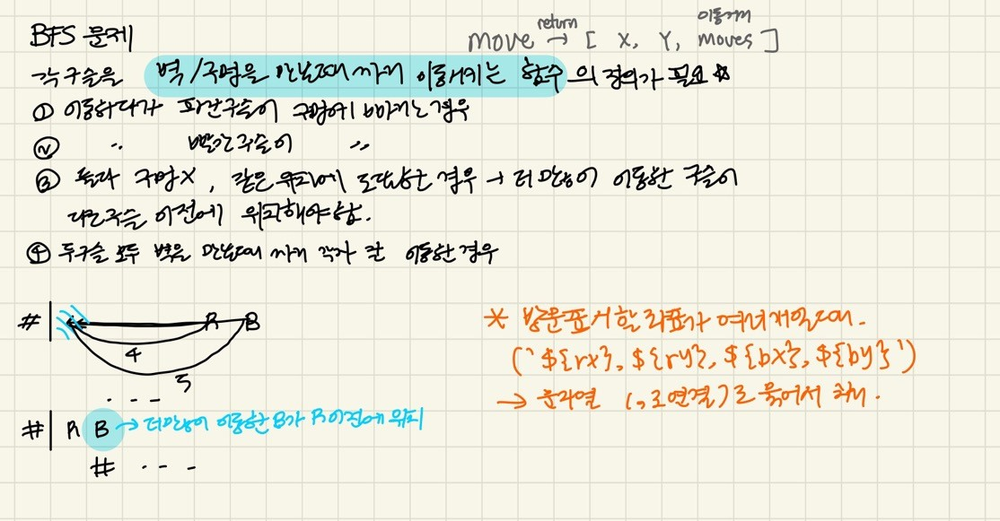

### 문제풀이

BFS 문제<BR/>


> 💡**참고** return문은 중첩과 상관없이, `현재 함수 전체를 빠져나가`면서 종료한다.<BR/>

return 문은 해당 함수에서 즉시 실행을 멈추고, 값을 반환하면서 함수를 종료합니다. 따라서, return이 이중 중첩된 while문과 for문 안에 있더라도, 해당 return이 실행되면 while문과 for문을 포함한 현재 함수 전체를 빠져나가고 함수가 종료됩니다.<BR/>
즉, return은 현재 실행 중인 함수(bfs)의 모든 코드 흐름을 종료하고, cnt + 1을 반환하는 것입니다. 이를 통해 더 이상 루프를 돌지 않고 바로 종료하게 됩니다.<BR/>
예를 들어, 아래와 같은 코드가 있다고 가정해 봅시다.<BR/>

```javascript
function test() {
  while (true) {
    for (let i = 0; i < 5; i++) {
      if (i === 3) return "종료";
    }
  }
  console.log("이 코드는 실행되지 않습니다.");
}

console.log(test());
```
이 경우, i === 3이 되면 return "종료";가 실행되고, 그 즉시 while과 for문을 포함한 함수 전체가 종료됩니다. while과 for문을 다 벗어나게 되는 것이죠.
