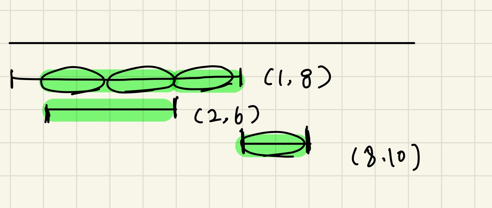

### 문제풀이

**그리디 알고리즘** 
1. 웅덩이의 **시작위치를 기준**으로 정렬한다. 
- 따라서, 현재의 웅덩이의 시작위치는 항상 이전 웅덩이의 시작위치 이상이다. 
2. 현재 웅덩이의 끝위치가 마지막 널빤지의 끝위치 이하인지 확인 
- 이하라면, 해당 웅덩이는 이전 널빤지들과 겹치는 부분에 놓여있기 때문에 건너뛴다. 
3. 2번이 아니라면, 현재 널빤지의 시작위치가 이전 널빤지의 끝나는 위치 이하인지 확인 
- `이전 널빤지의 끝나는 위치+1`을 새로운 s로 설정 
- 현재 웅덩이의 시작위치를 기준으로 새로운 널빤지를 두어야하므로 s를그대로 설정 
4. e-s를 L로나눈값을 올림해서 필요한 널빤지개수를 구하고, 널빤지가 끝나는 위치를 새롭게 갱신한다. 