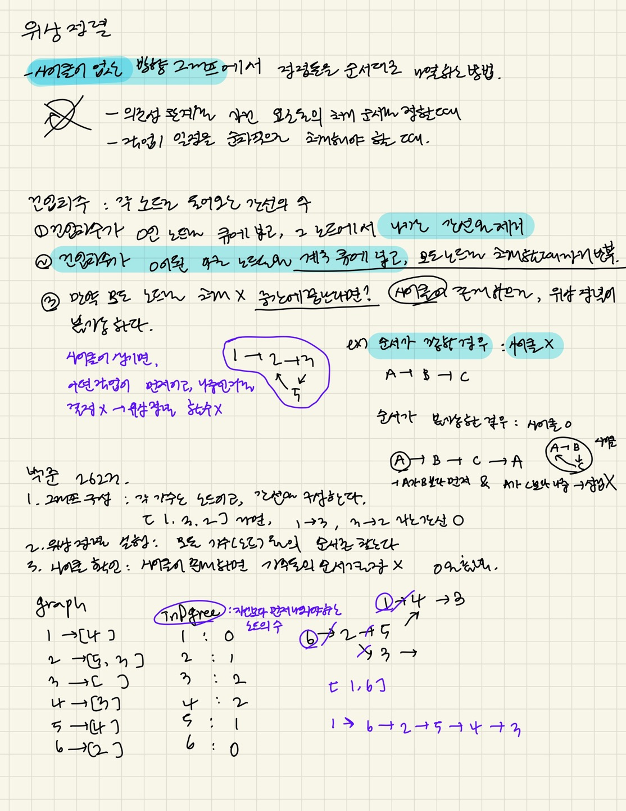

### 문제풀이

`위상정렬` : `사이클이 없는 방향그래프`에서 정점들의 순서를 나열하는 방법<br/>
1. 그래프 정의(from, to[])<br/>
2. 각 노드의 진입 차수<br/>
3. 진입차수가 0인 노드들을 큐에 추가<br/>
4. 큐를 순회하면서 노드를 결과에 넣고(===순서를 지정한다), `해당 노드에서 나오는 간선을 제거`(===`그 다음 노드의 진입차수--`;)<br/>

```js
const [N, M] = input[0];
const graph = Array.from({ length: N + 1 }, () => []); //그래프 정보
const inDegree = Array(N + 1).fill(0); //각 노드의 진입 차수

for (let i = 1; i <= M; i++) {
  const pdInfo = input[i];
  const count = pdInfo[0];
  for (let j = 1; j < count; j++) {//마지막 가수는 그 다음 노드x-> 마지막에서 두번째 가수 까지만
    const from = pdInfo[j];
    const to = pdInfo[j + 1];
    graph[from].push(to); //from->to
    inDegree[to]++; //to의 진입차수 1증가가
  }
}

const queue = [];
//진입차수가 0인노드를 큐에
for (let i = 1; i <= N; i++) {
  if (inDegree[i] === 0) {
    queue.push(i);
  }
}
console.log(queue);
const result = [];

while (queue.length > 0) {
  const current = queue.shift();
  result.push(current);

  for (const next of graph[current]) {
    inDegree[next]--;
    if (inDegree[next] === 0) {
      queue.push(next);
    }
  }
}

if (result.length === N) {
  //모든 노드의 순서를 매길수있는 경우
  console.log(result.join("\n"));
} else {
  console.log(0);
}
```