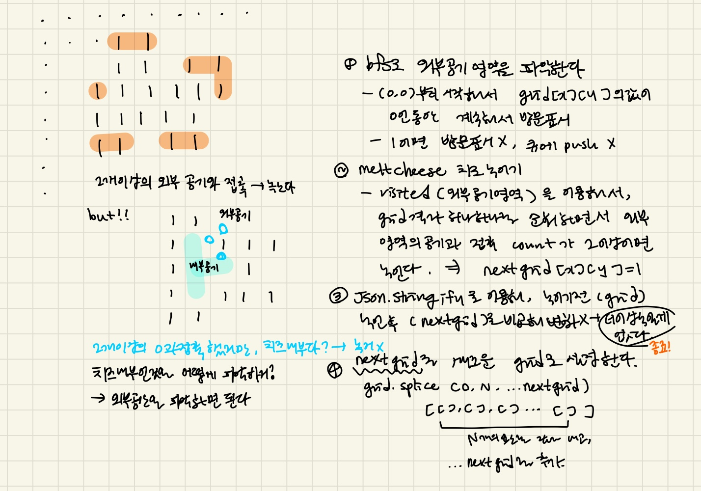

### 문제풀이


### 💡2차원배열 비교하는 법
`JSON.stringify()`: `자바스크립트 객체`나 `배열`을 `JSON 문자열`로 변환하는 메서드
```js
const arr = [
  [1, 2, 3],
  [4, 5, 6],
  [7, 8, 9]
];
const jsonString = JSON.stringify(arr);
console.log(jsonString);
```
출력 결과:
```js
"[[1,2,3],[4,5,6],[7,8,9]]"
```
JSON.stringify()는 2차원 배열을 문자열로 변환하는데, 각 하위 배열도 문자열로 변환하여 JSON 형식으로 표현한다.<br/>
결과적으로, 각 하위 배열이 []로 감싸진 형태로 변환되고, 모든 하위 배열이 쉼표로 구분된다.<br/><br/>
**따라서, 두 2차원 배열을 비교할 때, 요소를 각각 순회하지 않고 배열 자체가 동일한지 확인하고 싶다면, JSON.stringify()를 사용할 수 있다.**<br/>
```js
const isEqual1 = JSON.stringify(arr1) === JSON.stringify(arr2); // true
```