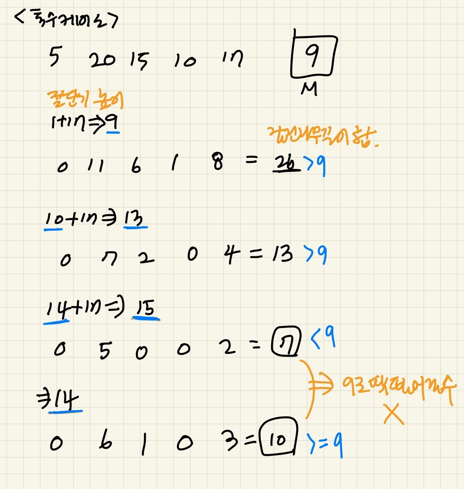

### 문제풀이

절단기의 최대높이를 목표값으로 이분탐색을 사용하면 된다.<br/>

- 이분탐색은 정렬된 배열을 기준으로 하지만, 이 문제의 경우 따로 배열을 두는 것은 아니다.<br/> 1,2,3,4...Math.max(...trees)의 가상의 숫자 배열이 있다고 가정한다.
- 이때 절단기의 최대높이는 tree높이들 중 최댓값이다.
- 최소높이는 1로 설정한다.<br/>
  최대, 최소높이의 mid값을 기준으로 절단기 높이의 최대값을 찾아나간다.<br/>
  이떄 주의해야할 것은 잘린 나무길이의 합이 `최소 M`이 되어야하므로,
  M으로 딱 떨어지지 않을 수 도있다.<br/>
  만약 분기문을 다음과 같이 작성하게되면, 잘린 나무길이의 합이 M으로 딱 떨어지지 않는 경우에 문제가 될수있다.

```js
if (sum === M) {
    answer = mid;
    break;
  } else if (sum > M) {
    start = mid + 1;
  } else {
    end = mid - 1;
  }
```

따라서 위 분기문을 다음과같이 구현해야한다.<br/>
잘린나무길이의 합(sum)이 M이상이면 우선 answer에 대입하고, 그 높이보다 더 큰 경우도 고려해볼 수 있으므로 start를 mid+1로 설정한다.

```js
if (sum >= M) {
  if (mid > answer) answer = mid;
  start = mid + 1;
} else {
  end = mid - 1;
}
```
