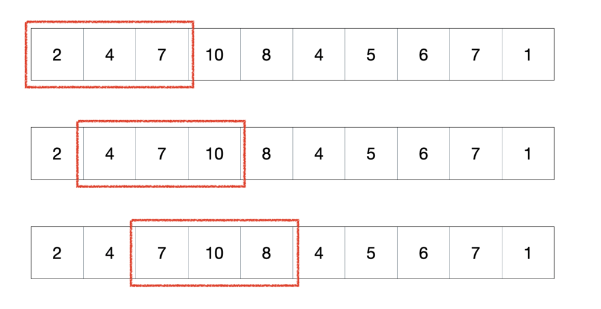

### 문제풀이
소수 ni개에서 n는 고정된값이 아니다. -> 투포인터를 이용해 가변길이의 부분배열의 합을 구해야한다.<br/>
> 소수 : 소수(素數, prime number)는 1보다 큰 자연수 중 `1`과 `자기 자신만`을 `약수`로 가지는 수<br/>

### 투포인터와 슬라이딩윈도우의 공통점
1차원 배열을 중복(중첩)으로 탐색해야 할 경우(= 각 원소마다 다른 원소와 비교하는 방식) O(N^2) : `중첩된 반복문` 이상 걸릴 시간 복잡도를 `부분 배열을 활용`하여 `O(N)` 으로 줄일 수 있다는 공통점이 있다.<br/>

## 투포인터
1차원 배열에서 배열을 가리키고 있는 2개의 포인터를 조작하여, 원하는 값을 얻는 알고리즘<br/>
-> `연속된`, `길이가 가변적인` 부분배열들을 활용해서 특정 조건을 일치시키는 알고리즘<br/>
<br/>
1) 부분 배열의 합이 target보다 크거나 같으면 Left += 1 (부분 배열의 길이를 줄여 합을 빼준다)<br/>
같을 때 Left를 더해주는 이유: 다음 배열을 탐색하기 위해
2) 부분 배열의 합이 target보다 작으면 Right += 1 (부분 배열의 길이를 늘려 합을 더해준다)<br/>
3) 부분 배열의 합이 target과 같으면 count += 1<br/>

### 구현
아래와 같이 자연수로 구성된 수열에서 합이 5인 부분 연속 수열의 개수를 구해보자.<br/>
위 그림과 같이 연속된 배열의 합이 5가 되는 부분 수열의 수를 찾으면 된다.<br/>
이중 반복문을 이용한 완전 탐색으로 문제를 해결할 수 도 있지만 그럴경우 O(N^2)의 시간 복잡도가 발생하게 되며 그 보다 적은 시간복잡도를 통해 문제를 해결해야 하는 경우라면 투 포인터 알고리즘을 활용하여 O(N)의 시간복잡도로 문제를 해결할 수 있다.
```js
function solution(n, arr) {
	let result = 0; // 부분 수열의 요소의 전체 합이 n인 부분 수열의 개수
  let sum = 0; // 부분 수열의 요소 전체 합
  let end = 0; // 투 포인터에서 끝 점에 해당된다.

  // 시작점 start를 배열 시작부터 오른쪽으로 한 칸씩 옮긴다.
  for(let start = 0; start < arr.length; start++) {
    // 끝점 end를 가능한 만큼 이동
    while(sum < n && end < arr.length) {
      sum += arr[end];

      end++;
    }

    if(sum === n) {
      result++;
    }

    sum -= arr[start];
  }

  return result;
}

const arr = [1, 2, 3, 2, 5];
console.log(solution(5, arr))
```
## 슬라이딩 윈도우
`연속된`, `길이가 고정적인` 부분 배열들을 활용해서 특정조건을 일치시키는 알고리즘<br/>
-> 구간의 너비가 일정하여, 포인터 두개가 없어도된다.<br/>
구간이 일정하기 때문에, 한 칸씩 앞으로 이동하면 겹치는 영역이 존재한다.<br/>
그래서 구간의 합이나 구간에서의 최솟값 등을 구할 때, 새로 영역으로 들어오는 값(+)과 그 전에 영역에 있었던 값(-)만 체크해주면 된다.<br/>


## 구현
**문제**<br/>
현수의 아빠는 제과점을 운영합니다. 현수 아빠는 현수에게 N일 동안의 매출기록을 주고 연속 된 K일 동안의 최대 매출액이 얼마인지 구하라고 했습니다.<br/>
만약 N=10이고 10일 간의 매출기록이 아래와 같습니다. <br/>이때 K=3이면
12 15 11 20 25 10 20 19 13 15
연속된 3일간의 최대 매출액은 11+20+25=56만원입니다. <br/>여러분이 현수를 도와주세요.<br/>
[입력설명]<br/>
첫 줄에 N(5<=N<=100,000)과 M(2<=K<=N)가 주어집니다.<br/>
두 번째 줄에 N개의 숫자열이 주어집니다. 각 숫자는 500이하의 음이 아닌 정수입니다.<br/>
[출력설명]<br/>
첫 줄에 최대 매출액을 출력합니다.<br/>

**입력 예제**<br/>
10 3<br/>
12 15 11 20 25 10 20 19 13 15<br/>

**출력 예제**<br/>
56<br/>


```js
function solution(n, k, arr) {
  let result = 0; // 길이 k의 부분 수열의 요소 전체 합의 최댓값
  let sum = 0; // 특정 부분 수열의 전체 합

  for(let i = 0; i < k; i++) {
    sum += arr[i];
  }

  result = sum;

  for(let i = k; i < arr.length; i++) {
    sum += (arr[i] - arr[i - k]);
    result = Math.max(result, sum);
  }

  return result;
}

const n = 10;
const k = 3;
const arr = [12, 15, 11, 20, 25, 10, 20, 19, 13, 15];

console.log(solution(n, k, arr));
```