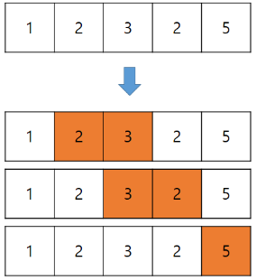
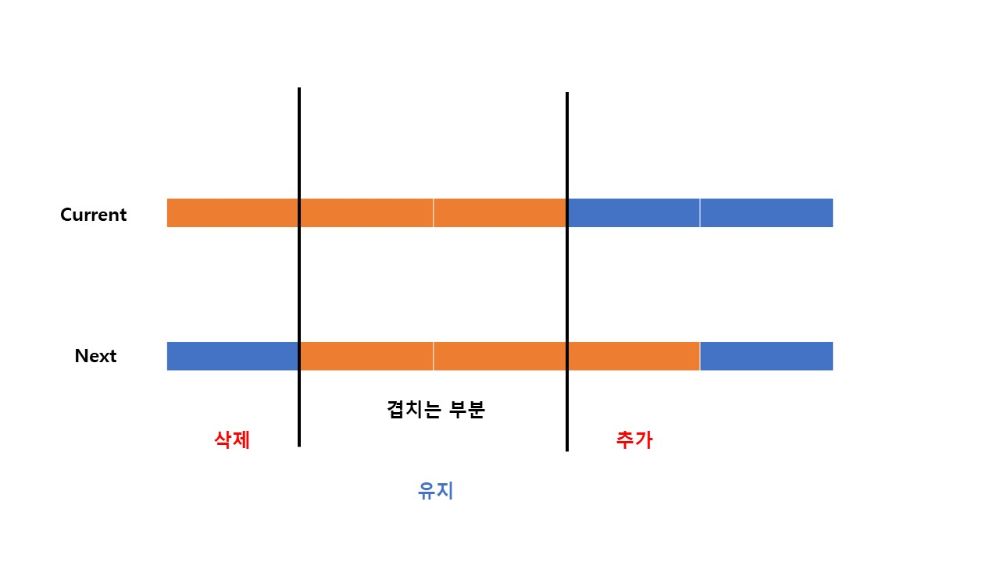

### 문제풀이

### 투포인터와 슬라이딩윈도우의 공통점
1차원 배열을 중복으로 탐색해야 할 경우(= 각 원소마다 다른 원소와 비교하는 방식) O(N^2) : `중첩된 반복문` 이상 걸릴 시간 복잡도를 `부분 배열을 활용`하여 `O(N)` 으로 줄일 수 있다는 공통점이 있다.<br/>

### 투포인터
1차원 배열에서 배열을 가리키고 있는 2개의 포인터를 조작하여, 원하는 값을 얻는 알고리즘<br/>
-> `연속된`, `길이가 가변적인` 부분배열들을 활용해서 특정 조건을 일치시키는 알고리즘<br/>
<br/>
1) 부분 배열의 합이 target보다 크거나 같으면 Left += 1 (부분 배열의 길이를 줄여 합을 빼준다)<br/>
같을 때 Left를 더해주는 이유: 다음 배열을 탐색하기 위해
2) 부분 배열의 합이 target보다 작으면 Right += 1 (부분 배열의 길이를 늘려 합을 더해준다)<br/>
3) 부분 배열의 합이 target과 같으면 count += 1<br/>
```js
while(start < N) {
    if(sum >=M) sum -= arr[start++]; // sum이 M보다 커졌을 때, 새로운 현재 값을 빼주고, start를 한칸 앞으로 이동한다. 
    else if(end == N) break;
    else sum += arr[end++]; //(sum이 M보다 작을 떄) sum에 새로운 현재 값을 더해준 후, end 포인터를 한 칸 이동
           
    if(sum == M) answer++; // sum이 M과 같은 값일 때 
}
```
### 슬라이딩 윈도우
`연속된`, `길이가 고정적인` 부분 배열들을 활용해서 특정조건을 일치시키는 알고리즘<br/>
-> 구간의 너비가 일정하여, 포인터 두개가 없어도된다.<br/>
구간이 일정하기 때문에, 한 칸씩 앞으로 이동하면 겹치는 영역이 존재한다.<br/>
그래서 구간의 합이나 구간에서의 최솟값 등을 구할 때, 새로 영역으로 들어오는 값(+)과 그 전에 영역에 있었던 값(-)만 체크해주면 된다.<br/>
