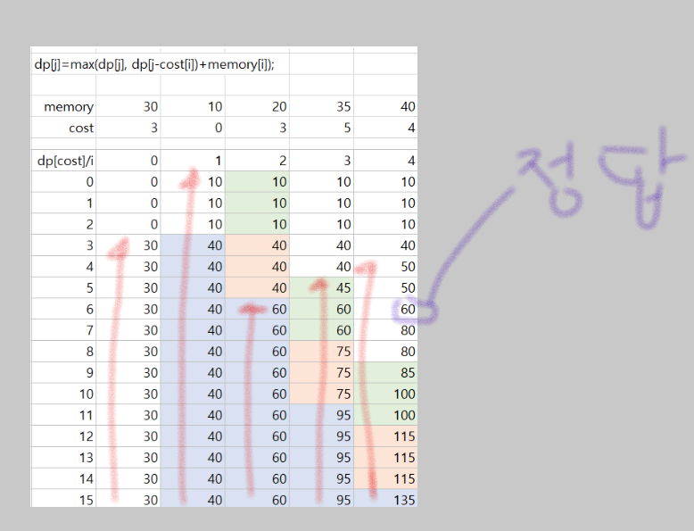

### 문제풀이

**DP 점화식 설계** 
**배열 정의** 
- dp[cost] = value: cost 비용으로 확보할 수 있는 최대 메모리 
- cost가 X일 때, 얻을 수 있는 최대 메모리를 dp[X]에 저장 
**점화식** 
- 앱을 비활성화하지 않으면 dp[cost] 그대로 유지 
- 앱을 비활성화하면 dp[cost] = max(dp[cost], dp[cost - disable_cost] + memory) 
**목표** 
- dp[cost] >= M이 되는 최소 cost를 찾기 
 

