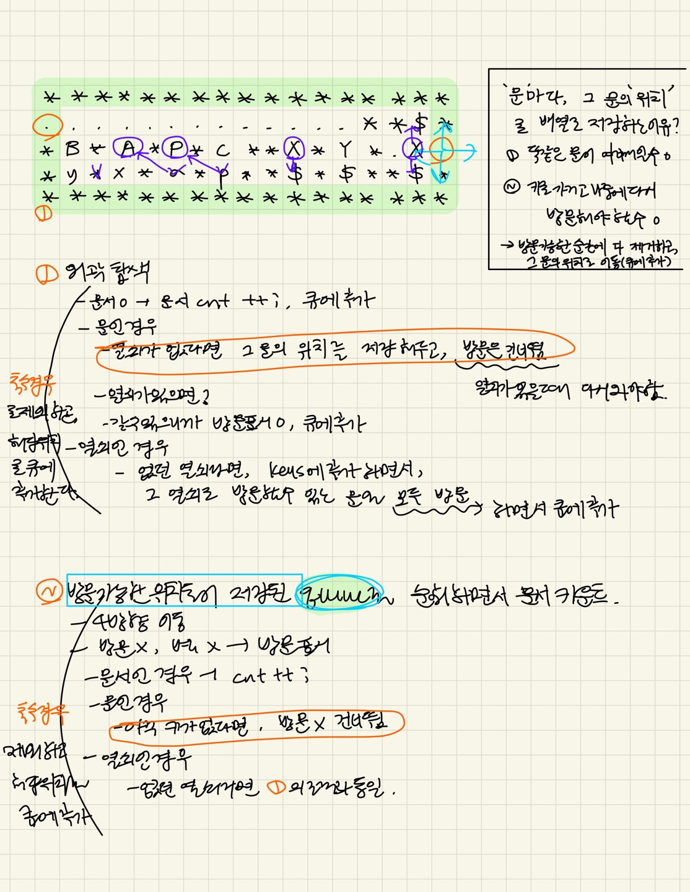

### 문제풀이

너비우선 탐색(BFS) 
1️⃣ 외곽 탐색 
- 빌딩의 외곽(가장자리)에서 탐색을 시작 
- 외곽 탐색을 통해 빈 공간, 문서, 열쇠, 문을 확인 
  - 문서($)를 발견하면 문서 수를 증가 
  - 열쇠(a~z)를 발견하면 해당 열쇠를 저장하고, 그 열쇠로 열 수 있는 모든 문을 열어 이동할 수 있도록 함 
  - 문(A~Z)을 발견했지만 해당 열쇠가 없다면, 문의 위치를 기록하고 열쇠를 얻은 후 다시 방문할 수 있도록 처리 

2️⃣ BFS 탐색 
- 외곽 탐색에서 시작된 위치들을 BFS(너비 우선 탐색) 방식으로 처리 
- BFS로 상하좌우를 탐색하며: 
  - 문서($)를 만나면 문서 수를 증가
  - 열쇠(a~z)를 만나면 열쇠를 획득하고, 그 열쇠로 열 수 있는 모든 문을 큐에 추가하여 탐색을 계속함 
  - 문(A~Z)을 만나면 열쇠가 있을 경우 문을 열고 탐색을 계속하고, 열쇠가 없을 경우 문의 위치를 저장하여 나중에 열쇠를 얻은 후 다시 방문할 수 있도록 함 
