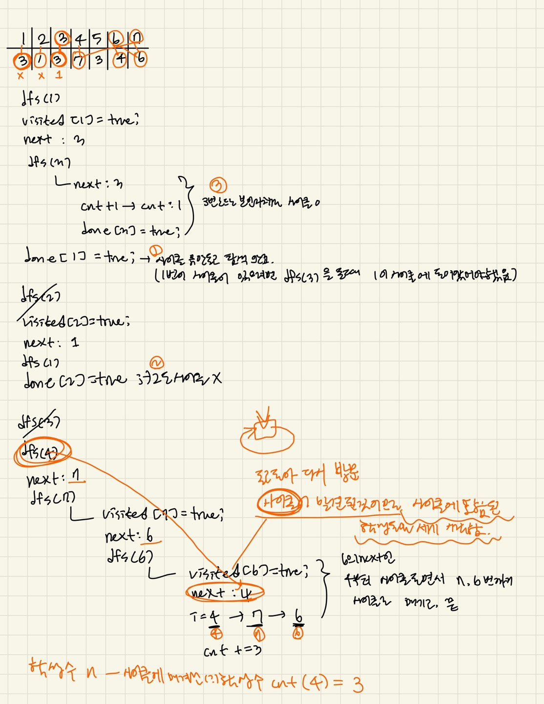

### 문제풀이

깊이우선탐색<br/>
학생들이 각자 고른 학생이 연결되어 하나의 사이클(순환)을 이루는지 여부를 파악해야한다.<br/>
사이클에 포함된 학생들은 같은 팀으로 묶을 수 있으므로, 사이클에 포함되지 않은 학생들만 세어야 한다.<br/>

### DFS사용
각 학생에 대해 DFS 탐색을 진행하여 해당 학생이 선택한 다음 학생을 따라가며 사이클을 찾는다.<br/>
```js
while (T > 0) {
  const n = +input[index]; //학생수
  const temp = input[index + 1].split(" ").map((el) => +el); //학생들의 번호

  arr = [0, ...temp];
  visited = Array(n + 1).fill(false); //방문여부
  done = Array(n + 1).fill(false); //탐색완료 여부

  for (let i = 1; i <= n; i++) {
    if (visited[i]) continue;

    dfs(i);
  }

  console.log(n - cnt);

  index += 2;
  T--;
  cnt = 0;
}

function dfs(node) {
  visited[node] = true;
  const next = arr[node]; //현재 학생이 선택한 학생

  if (!visited[next]) dfs(next);
  else if (!done[next]) {
    //방문은 했지만, 탐색이 완료되지않은 경우
    for (let i = next; i !== node; i = arr[i]) {
      //본인(node)로 돌아오지않는 동안 사이클에 속한 학생수 카운트
      cnt += 1;
    }

    cnt += 1; //본인까지 포함
  }

  done[node] = true; //node번 학생이 속한 사이클의 탐색완료 표시
}

```

