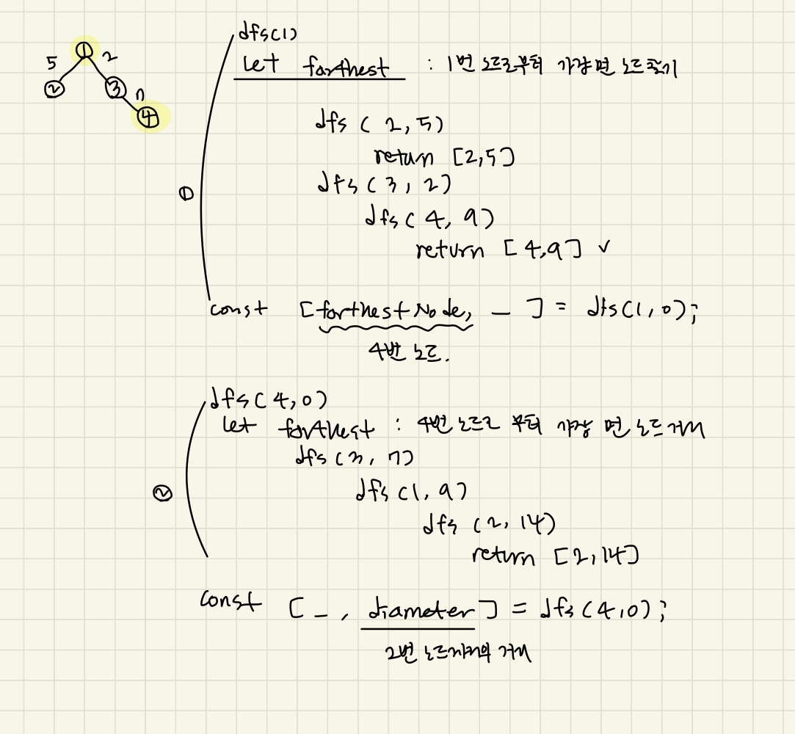

### 문제풀이

dfs 깊이우선 탐색 
- **두번의 dfs**가 필요하다. 
1. 임의의 노드에서 시작해 가장 먼 거리 노드를 찾기 
    - 거리계산은 필요없고 **가장 먼노드가 무엇인지** 찾기만 하면 된다. 
2. 그 노드로부터 다시 가장 먼 노드까지의 거리 구하기 
    - 가장 먼노드까지의 **거리가 얼마인지** 
두번의 dfs에서 거리계산이 필요한 경우가 있기 때문에, dfs로직을 재사용하기 위해선 거리 계산 로직을 넣어줘야한다.
