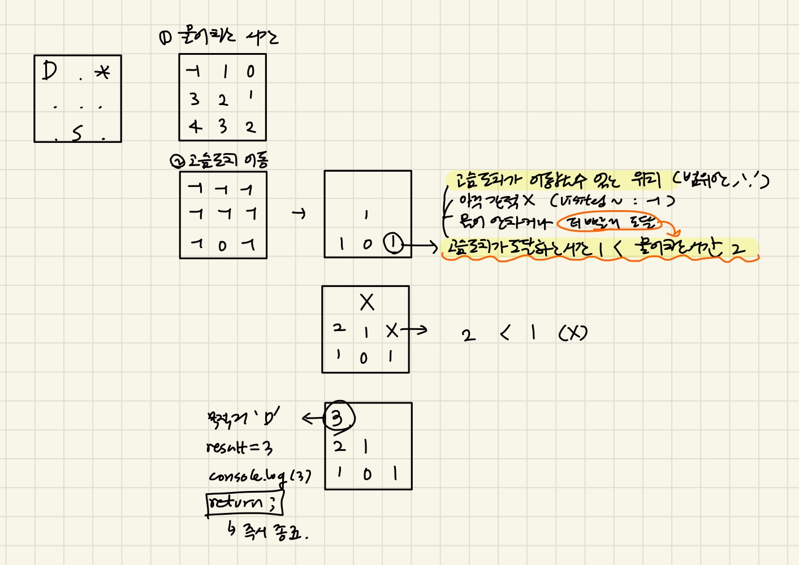

### 문제풀이

- 물은 매번 인접한 빈칸으로 퍼진다<br/>
- 고슴도치는 매분 인접한 빈칸으로 이동가능(단, 물이 찰 예정인 칸은 이동불가)<br/>
  -> 물의 퍼짐을 먼저 계산 후, 고슴도치의 이동을 고려한다.<br/>

**⭐ 고슴도치와 물을 각각의 bfs로 처리**<br/>
1. 물의 퍼지는 시간을 계산하는 bfs<br/>
2. 고슴도치의 최단경로를 계산하는 bfs<br/>
<br/>

### 기존코드
- 하나의 큐로 계산하는 경우 물과 고슴도치가 같이 퍼져나감<br/>

```js
const bfs = () => {
  const queue = ..
  while (queue.length) {
    ...
    //목적지 도착
    if (x === dest[0] && y === dest[1]) {
      answer = Math.min(newVisited[x][y], answer);
    }

    //물 확장
    const updated = []; //물이 찰 위치
    for (let [a, b] of waterFilled) {
      for (let i = 0; i < 4; i++) {
        const na = a + dx[i];
        const nb = b + dy[i];
        ...
      }
    }

    //고슴도치 이동
    for (let i = 0; i < 4; i++) {
      const nx = x + dx[i];
      const ny = y + dy[i];
      ...
    }
  }
};

bfs();
```
