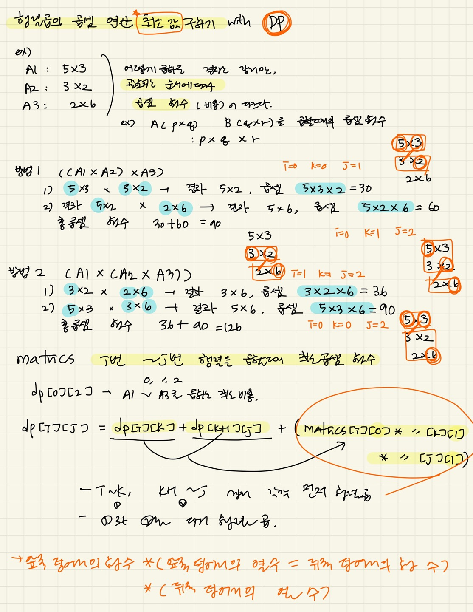

### 문제풀이

dp 문제 
- 행렬 곱의 연산 비용(곱셈 횟수)의 최솟값을 구하는 dp문제 
- dp[i][j] : i번쨰 행렬 ~ j번쨰 행렬까지의 행렬 곱 = dp[i][k], dp[k+1][j]의 행렬 곱을 각각 연산후, 두 덩어리를 다시 행렬곱 하는 연산 비용을 더하기 
- 행렬이 한개인 경우, 그 구간의 곱셈 비용은 0이다. 따라서 dp[i][i] = 0;으로 초기화 
- 부분 행렬의 수 length는 2부터 N개 까지 -> length 길이의 부분 행렬 곱 모두 구하기 
- `dp[i][j]` = `dp[i][k]` + `dp[k+1][j]` + `(Matrics[i][0] * Matrics[k][1] * Matrics[j][1])` 
- 백준 11066 문제와 유사 

