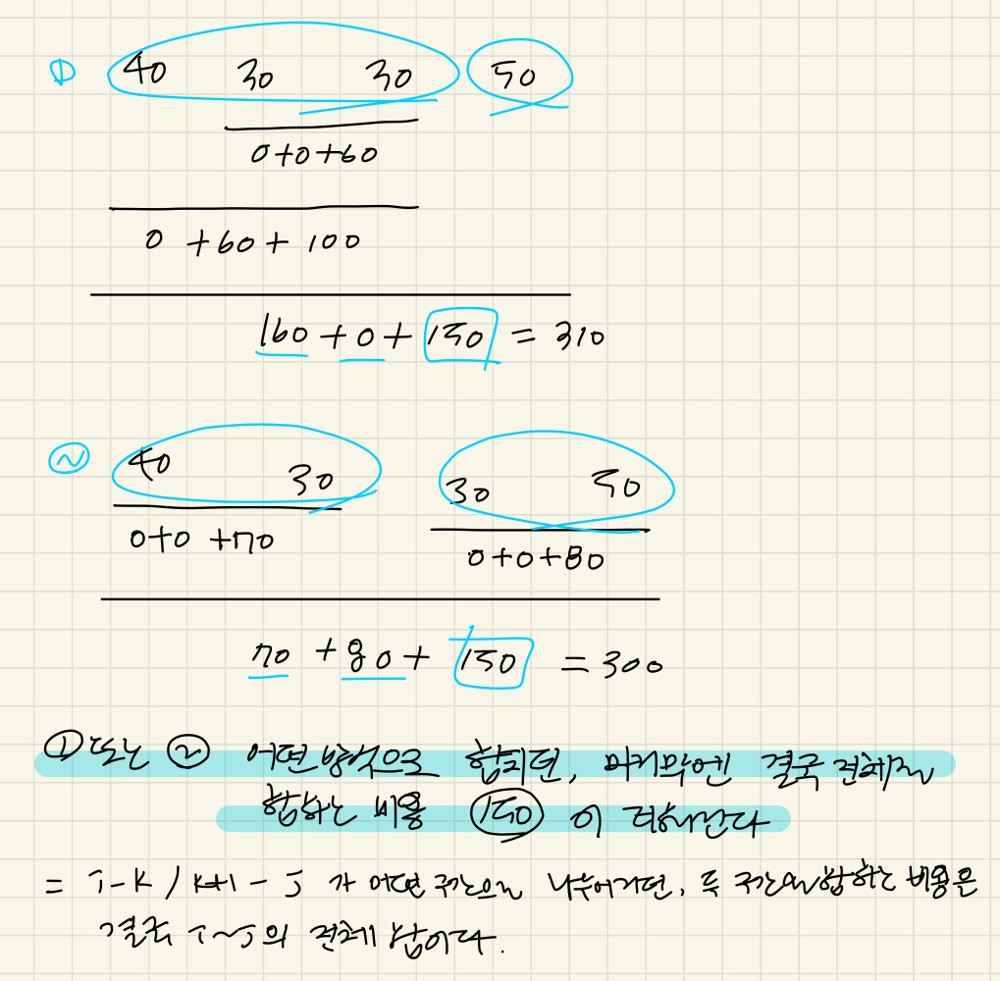

### 문제풀이

- 여러개의 파일을 한번에 두개씩만 합칠 수 있는데, 합칠 때마다 그 두파일의 크기의 합만큼 비용이 든다. 
  -> 구간을 어떻게 나누어 합칠지 최적의 순서를 찾는 문제 
  -> i~j 구간의 파일을 합치는 최소비용은? 

1. dp[i][j] : i번째 파일 부터 j번째 파일을 합치는 최소 비용 
   - ( i~k + k+1~j )+ 전체 파일을 합치는 비용 sum(i~j) 
2. 삼중 for문 
   - length : 2 ~ K 
   - i : 0 ~ (K-length), j : i+length-1 
   - k : i ~ j-1 

