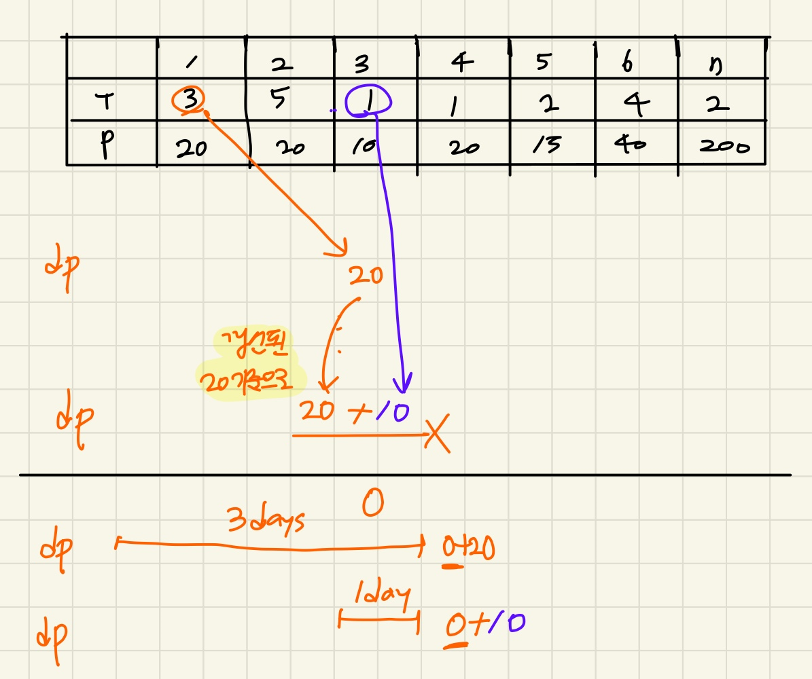
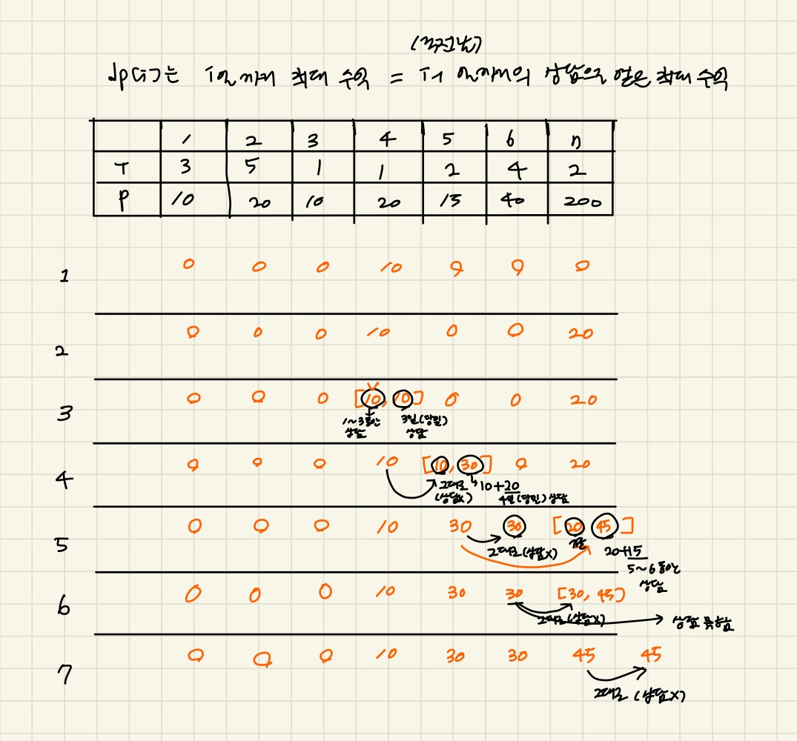

### 문제풀이

dp문제 
`dp[i]` : i번째 날짜에 얻을 수 있는 최대 수익 = `i-1`날 까지의 상담으로 얻는 최대 수익 
> ⚠️ **주의할 점** 
    **i날에 T기간의 상담을 했다면 상담끝나는 마지막 날인 i+T-1에 DP를 갱신하는 것이 아니라, 그 다음날(i+T)의 수익으로 계산해야한다.** 
    예를들어, 1일에 3일동안의 상담을 하는 경우 3일(i+T-1)에 수익을 10으로 갱신하면, 3일에 하루 상담한 수익 갱신이 기존의 10을 기준으로이루어진다. 하지만 기존의 10은 해당일에 상담을 하지 않는 것을 기준으로 계산된 값이다. 
    

예제 입력 1 
