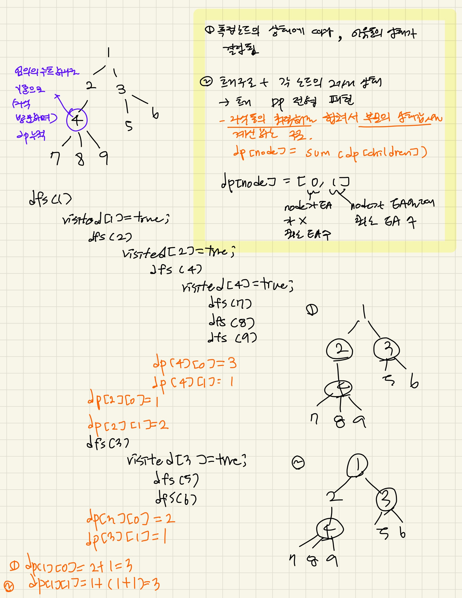

### 문제풀이

- 사이클이없는 트리 구조
    - dfs/dp
    - '얼리어답터가 아닌 사람의 모든 친구는 얼리어답터여야 한다'
    -> 특정 노드의 상태에 따라 이웃노드의 상태가 결정된다
    ex. 노드 a가 EA가 아니라면, 이웃노드 b는 무조건 EA
        노드 a가 EA라면, 이웃노드 b는 EA이거나 EA가 아님
- 특정 노드를 기점으로 해당 노드의 이웃노드들을 DFS 순회하면서, EA의 최소 수를 누적한다.
    - 임의의 루트를 하나 정한다
    - 자식 방문 후에 돌아올 때 dp값 누적한다.
        - EA일 때 자식의 두 상태 중 최소값을 더하고, EA가 아닐 때 자식이 EA인 경우의 값을 더한다.

