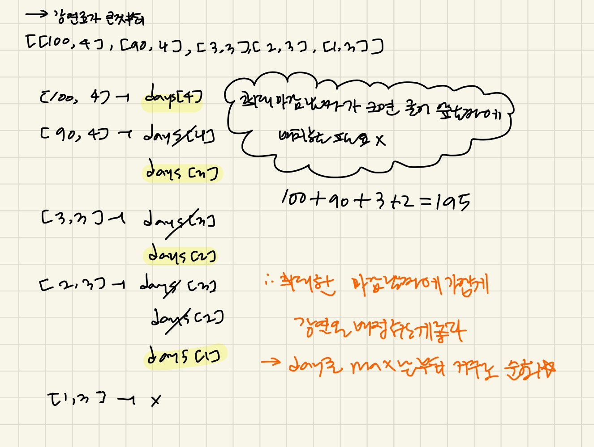

### 문제풀이

> 💡**그리디 풀이 공략** 
    - 희소한 자원을 최대한 늦게 사용하기 위해서 뒤에서 부터 순회하는 전략을 자주 사용한다. 
    - "데드라인이 있는 작업"이나 "날짜를 기준으로 배치하는 문제"에서 매우 효과적
    
이 문제의 핵심은 강사료가 높은 것부터 순회하면서, **날짜를 뒤에서 부터 배정**하는것이다 

1. 강사료가 높은 순으로 정렬 
2. 강연들을 순회하면서, 해당 강연을 할 수 있는 최대 날짜부터 시작해서 배정한다. 
- 해당날짜에 이미 배정이 되었다면, 다음 날짜를 탐색(day--), 배정하면 다음 강의를 배정하기위해 break 

<정리> 
이 문제의 경우 강연을 늦게 할수록 좋다. 그래야 앞선 날짜들에 좋은 강연들을 또 배치할 수 있기 때문에 
-> 뒤의 날짜에 배정할수있음에도, 앞날짜에 배정하는 것은 마감시간이 빠르고 강연료가 높은 강연들을 배치하는 것을 방해한다.