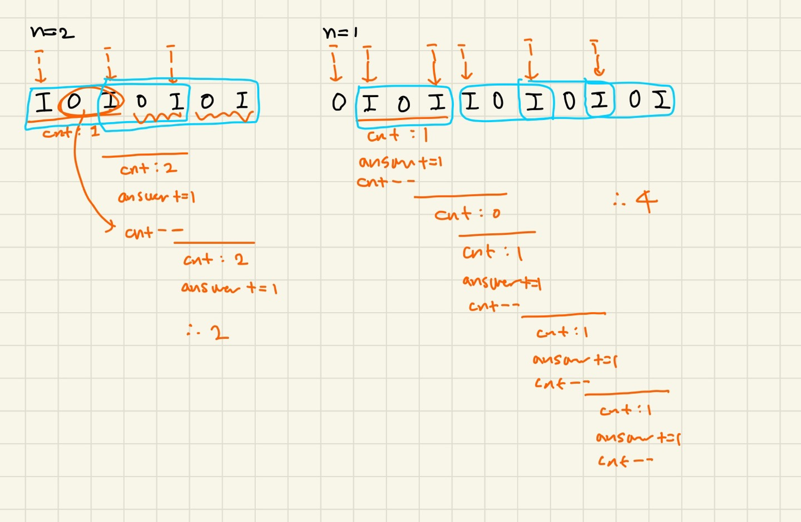

### 문제풀이

### 처음 풀이
Pn을 구해놓고, S의 첫번째 문자부터 slice하면서 비교한다. 
`S.slice(i, i + P.length)`의  시간복잡도는 O(k) : k는 슬라이스의 길이 이다. 
> 💭 내부적으로 slice는 새로운 문자열을 복사해서 만들어야한다. 복사하는 과정에서 슬라이스의 길이 만큼 시간복잡도가 소요된다.
따라서 이 풀이의 시간복잡도는 O(M*N) 이다.(루프 M번 반복, slice의 길이는 2N+1) 
-> 시간초과로 인해 부분점수 50점이다.

### 최종 풀이

Pn의 패턴자체는 I로 시작해서 OI가 연속해서 N번 나오는 형태이다. 
`slice`대신 `OI가 연속해서 N번나오는 형태`가 총 몇번인지를 계산하면된다. 
S를 순회하면서 IOI가 나오면 OI의 개수 count++, 만약 count가 N이면 Pn이 한번 등장한것이므로 answer++
- i++(그다음 문자는 O일것이므로 건너뜀)
- count가 N이면 이제 다음 순회에서는 OI가 한번 빠지는 꼴이므로 count--