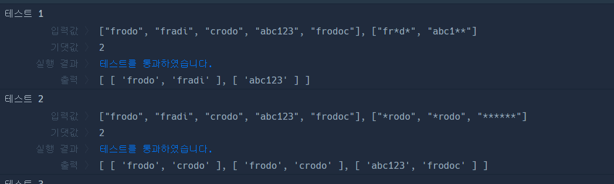

### 문제풀이

1. 주어진 banned_id별로 가능한 uid후보군들을 bid인덱스로 매칭되는 배열에 저장한다. 

2. dfs 활용 -> 주어진 후보군으로 가능한 모든 경로를 찾아야한다. 
- i번째 bid를 선택하는 시점에서, 이전에(0 ~ i-1) 사용되었던 uid는 선택할수없다. 
    - 예를 들면 예제2에서 bid_idx=0에서 frodo를 선택했다면 bid_idx=1에서 frodo를 선택할수없다. -> visited 배열로 관리 
        - 선택하면 visited, result Set에 add 했다가, dfs돌리고, 다시 delete 
- 최종적으로 선택된 uid들을 관리하는 results Set이 필요하다. 
    - result에 선택했던 uid들을 담은은 이유이기도하다. 
    - 전체 result에서, `선택된 uid들이 같지만 그 순서가 다른 경우`는 같은 경우로 보아야한다. 
    `frodo,crodo,abc123` === `crodo,frodo,abc123` 
    - 이 두개가 `같은 case`인지 비교하려면, `sort후 join한 문자열`(`abc123,crodo,frodo`)을 `Set`으로 관리하면된다. 