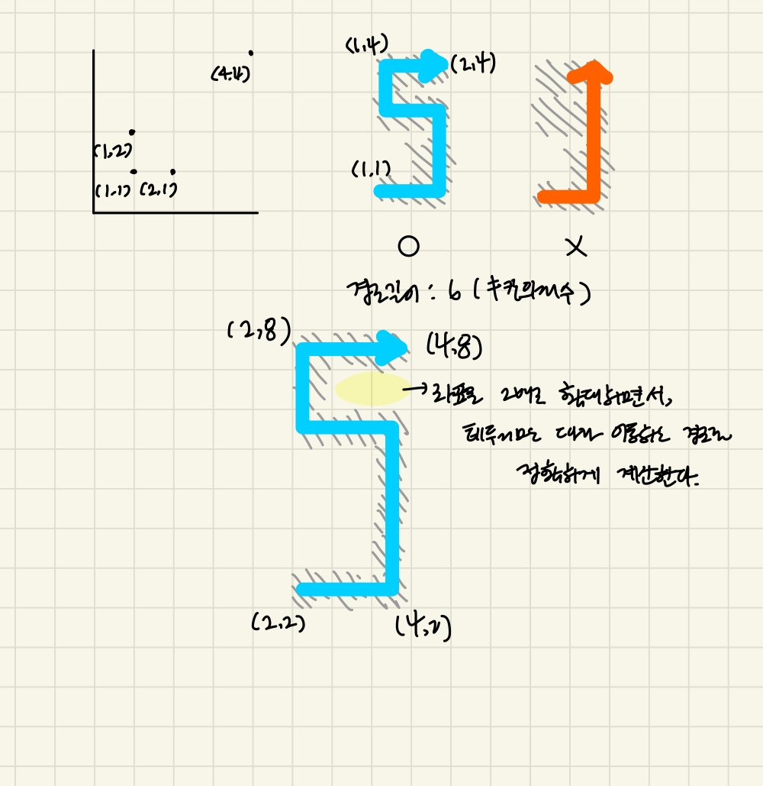

### 문제풀이

최단 경로 BFS 문제이다. 
이문제의 핵심은 사각형 `테두리만 밟으면서 이동해야한다` 
- 2차원 map을 정의한다
- map내부와 테두리를 구분한다(내부: 0, 테두리: 1, 나머지: -1)
    - rectangle의 각 사각형 좌표를 순회할 때,
        - 현재 사각형의 내부를 거르더라도, 앞선 사각형의 내부도 같이 걸러야하기 때문에, 바로 else문이아닌 `else if (map[i][j] !== 0) {` elif의 추가 조건이 필요하다. 
- 이때 테두리를 정확히 인지하지 못할 수 있다. 예를들면 다음과 같은 경우 > 
     
    `ㄷ`이지만 `ㅁ`으로 인식하고 `|`직진만해서 갈 수 있다. 
    따라서 `좌표를 2배로 확대`한다. -> 테두리만 따라 이동하는 경로를 정확하게 계산할 수 있다. 
     - 시작위치, 아이템 위치, 방문 표시map 모두 2배 확대한 것을 기준으로 해야한다. 
     - `dist`를 따로 큐에 추가하지않고, `vistied` 배열만으로 1씩 늘리면서 경로의 길이를 탐색할 수 있다. 
    -> 마지막에 `dist/2`의 값을 반환한다.

