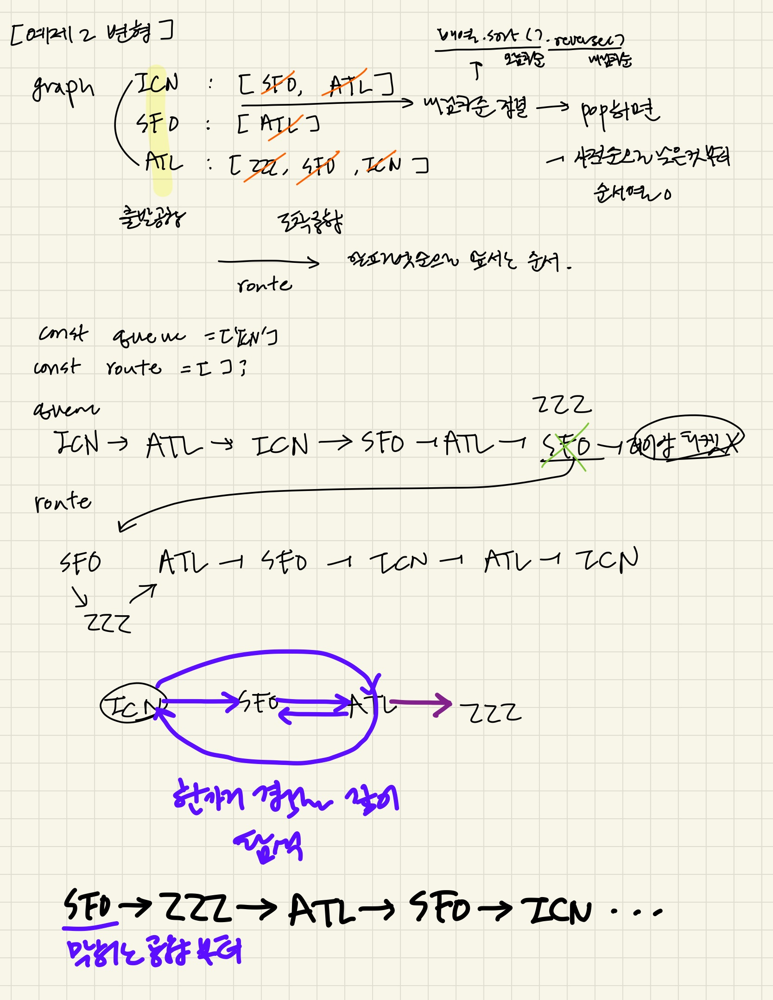

### 문제풀이

ICN에서 출발해 스택을 이용해 깊이 우선 탐색을 수행하는 방식 
    - 모든 티켓을 순차적으로 사용해 경로를 완성하는 것이 목표 -> 최단 거리를 찾는 bfs구조x 
    - 현재 위치(`top`)를 가져오고, 갈수있는 목적지(`nextList 중 하나`)가 있으면 push해서 더 깊이 들어감, 더이상 갈 수 없으면, pop으로 되돌아옴 
    - bfs는 queue.shift()로 가장 먼저 들어온 노드부터 꺼내서, 모든 인접 노드를 같은 레벨에서 탐색 
1. 항공권 정보를 출발지를 기준으로 그래프에 저장한뒤, 각 목적지를 사전순의 역순으로 정렬해 쌓아둔다. 
2. ICN에서 출발해 깊이 우선 탐색을 진행
    - 스택에 ICN부터 담아서 다음 목적지(`NEXT`)(사전순으로 빠른(POP))를 스택에 추가
    - `NEXT`부터 다시 다음 목적지를 추가한다.
    -> 계속 하나의 경로로 깊이 우선 탐색을 진행하다가
    - 더 이상 갈 곳이 없으면, 마지막의 경로가 막힌 공항 부터 ROUTE에 추가한다.
    - ROUTE에는 순서상 후순위(이후의 순서열에 더이상X)의 공항부터 차곡차곡 쌓이게 된다.
3. ROUTE의 역순을 반환

