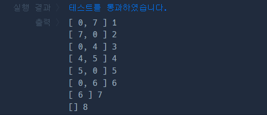

### 문제풀이
큐 시뮬레이션을 이용해, 시간 단위의 흐름을 제어한다. 
다리를 하나의 고정된 길이(bridge_length)의 큐로 보고, 매 초마다 트럭이 다리 위를 한 칸씩 이동한다고 가정한다. 
- 매 반복에서 먼저 shift로 다리 맨앞의 트럭을 내보내고(빈칸이어도 상관없음), 무게를 차감한다. 
- 이어서 남은 트럭들 중 첫번째 트럭을 다리에 올릴 수 있는 지 검사한다. 
    - 만약 다음 트럭을 올렸을 경우, 기준 무게보다 초과된다면, 빈칸을 넣어 시간만 흐르게 한다. 
    - 초과하지 않는다면, 해당 트럭을 진입해 이동한다. 
- 매 초마다, 트럭의 진입/이동, 퇴출을 시뮬레이션 하면서 모든 트럭이 다리를 건너는 총 시간을 계산한다. 
