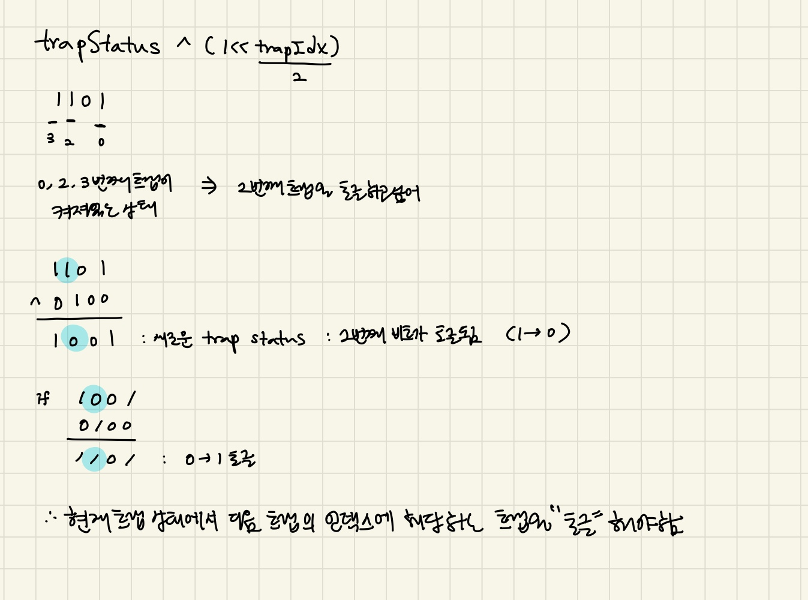

### 문제풀이
1. 상수정의
```js
const ORIGIN = 0 //정상적인 도로 방향
const REVERSED = 1 //트랩이 활성화 되었을 때 도로의 방향이 반대로 뒤집히는 상태태
const INF = 987654321
```
2. 함수 solution
```js
/*n: 노드의 수
start, end: 시작점과 끝점
roads: 도로 정보
traps: 트랩 정보*/
const edges = new Array(n+1).fill().map( _ => [])
const di = new Array(n+1).fill().map( _ => new Array( 1 << traps.length).fill(INF))
const isTrapList = new Array(n+1).fill().map( (_,idx) => traps.findIndex( trapIdx => trapIdx === idx))
```
edge: 각 노드에 연결된 도로 정보를 저장<br/>
di: 다익스트라 알고리즘에서 사용하는 비용 테이블<br/>
> 1 << traps.length : 비트마스크의 활용<br/>
    - 1을 왼쪽으로 트랩의 개수만큼 이동시킨다 = 2의 거듭게곱 값을 구하는 연산(2^(traps.length))
    - 트랩들이 활성화되었는지 여부를 비트마스크로 관리<br/>
    - 각 비트는 하나의 트랩을 나타내고, 그 비트가 1이면 활성화, 0이면 비활성화<br/>
    ex> 예를 들어, 트랩이 3개 있다고 가정하면, trapStatus라는 변수는 3비트로 트랩의 상태를 기록:<br/>
    000: 모든 트랩이 비활성화<br/>
    001: 첫 번째 트랩만 활성화<br/>
    010: 두 번째 트랩만 활성화<br/>
    111: 모든 트랩이 활성화<br/>

isTrapList: 해당 노드가 트랩인지 여부를 저장하는 배열<br/>
트랩이 아닌 경우에는 -1을, 트랩이면 해당 트랩의 인덱스를 저장
### 다익스트라 비용 테이블
**기존 다익스트라**: 각 노드로 도달하는 최소 비용을 단일 테이블에 저장. 트랩이나 상태에 따른 구분이 없음.<br/>
예: di[node] = [최소 비용]<br/>
**미로 탈출 문제 다익스트라**: 각 노드에 대해 트랩 상태별 최소 비용을 여러 테이블(2차원 배열)로 저장.<br/>
트랩이 활성화되었는지에 따라 비용이 달라짐.<br/>
예: di[node][trapStatus] = [트랩 상태별 최소 비용]<br/>

### 도로 정보 설정
```js
roads.forEach( road => {
    const [start, end, cost] = road
    edges[start].push([cost, end, ORIGIN])
    edges[end].push([cost, start, REVERSED])
})
```
### 다익스트라 알고리즘을 위한 준비
```js
const trapStatus = 0//트랩의 상태 : 초기에는 모든 트랩이 비활성화화
const firstCost = 0
const Q = new MinHeap()//최소힙을 사용해 가장 적은 비용의 경로부터 탐색
const firElem = makeQElement(firstCost, start, trapStatus)
Q.push(firElem)
```
### 다익스트라 알고리즘 실행
```js
while(Q.size()){
    const [cost, position, curTrapStatus] = Q.pop()//현재까지의 비용이 가장 적은 경로를 꺼냄냄
    
    edges[position].forEach( edge => {//현재 노드에 연결된 도로를 탐색하며 다음노드로 이동할 수 있는 지확인인
        const [nextCost, goal, direction] = edge
        const curDirection = findEdgeDirection( position, goal, curTrapStatus, isTrapList)//도로의 방향을 결정정
        if( direction !== curDirection ) return
        
        const totalCost = cost + nextCost
        
        if(totalCost < di[goal][curTrapStatus]){
            const nextStatus = findNextTrapStatus( goal, curTrapStatus, isTrapList)//트랩에 도착했을 때 트랩상태를 갱신하는 함수
            di[goal][curTrapStatus] = totalCost
            Q.push(makeQElement(totalCost, goal, nextStatus))//새로운 비용이 기존 비용보다 적다면 우선순위 큐에 추가하여 다음 경로를 탐색
        }
    })
}
```

### 목표노드가 트랩일 경우, 현재의 트랩상태 업데이트하기
```js
function findNextTrapStatus(goal, trapStatus, isTrapList) {
    const trapIdx = isTrapList[goal]  // goal 노드가 트랩인지 확인
    if (trapIdx === -1) return trapStatus  // 트랩이 아니면 그대로 트랩 상태 반환
    return trapStatus ^ (1 << trapIdx)  // 트랩이면 해당 트랩의 상태를 토글하여 반환
}
```
### `trapStatus ^ (1 << trapIdx)`
```
trapStatus ^ (1 << trapIdx)는 트랩 상태를 토글(반전)하는 비트 연산입니다. 

비트 연산 기초
1. XOR 연산 (^)
XOR(배타적 논리합) 연산은 두 비트가 서로 다를 때 1을 반환하고, 같을 때 0을 반환합니다.
예: 0 ^ 0 = 0, 1 ^ 1 = 0, 0 ^ 1 = 1, 1 ^ 0 = 1

2. 비트 이동 연산 (1 << trapIdx)
<< 연산은 1을 왼쪽으로 trapIdx만큼 이동시킵니다.
예를 들어, 1 << 0은 0001, 1 << 1은 0010, 1 << 2는 0100이 됩니다.
즉, `1 << trapIdx`는 trapIdx번째 비트만 1이고, 나머지 비트는 0인 숫자를 생성합니다.

trapStatus ^ (1 << trapIdx) 설명
이 식의 목적은 trapStatus의 trapIdx번째 비트 값을 토글하는 것입니다. 다시 말해, 해당 트랩이 켜져 있으면 끄고, 꺼져 있으면 켜는 동작을 수행합니다.
```
