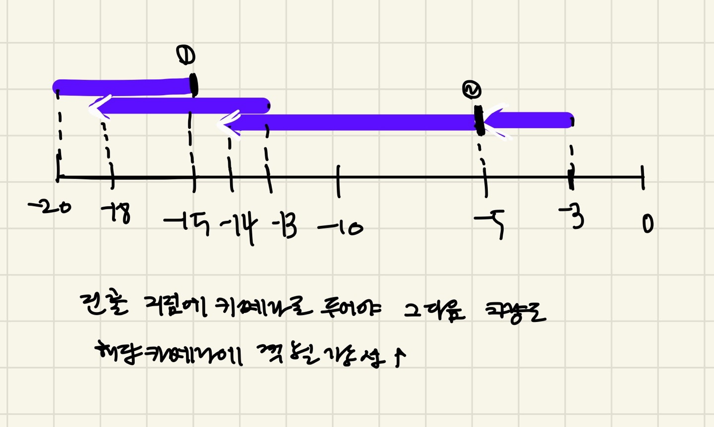

### 문제풀이

like 작업 스케줄링(가능한 많은 작업을 시간안에 처리하는 문제) -> 그리디 알고리즘 
1. 차량의 진출 시점 기준으로 정렬한다.
    - 가장 먼저 나가는 차량부터 처리하면, 그 차량을 기준으로 카메라를 설치하고 겹치는 차량들까지 한번에 처리할수있기 떄문
    - 매순간 최대한 끝으로 설정해야 다음 차량도.. 그 설치구간에 걸쳐질 가능성이 높다.
    