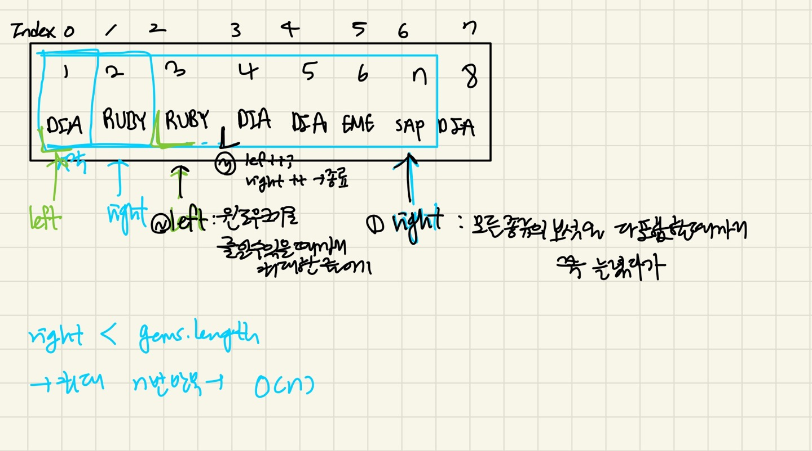

### 슬라이딩 윈도우 기법
- 연속적인 부분 구간을 대상으로, 매번 처음부터 끝까지 구간을 새로 탐색x -> 기존구간에서 일부를 제거하고 새로운 값을 추가하는 방식으로 효율적으로 처리한다.

### 언제사용하나?
배열이나 문자열에서 `특정 조건을 만족하는 최대/최소 길이의 부분 배열`, `최대/최소합`등의 문제는 슬라이딩 윈도우 기법을 사용하면 불필요한 계산을 줄려 O(n)으로 해결가능

### 문제풀이
- 주어진 배열 gems에서 모든 종류의 보석을 포함하는 가장 짧은 구간 찾기
1. Set -> 유일한 보석으 종류 계산
2. 슬라이딩 윈도우 기법으로 구간을 확장/줄이면서 모든 종류의 보석을 포함하는 가장 짧은 구간을 찾는다.
3. 해시맵을 사용해 현재 슬라이딩 윈도우에서 종류별 보석의 개수를 추적
