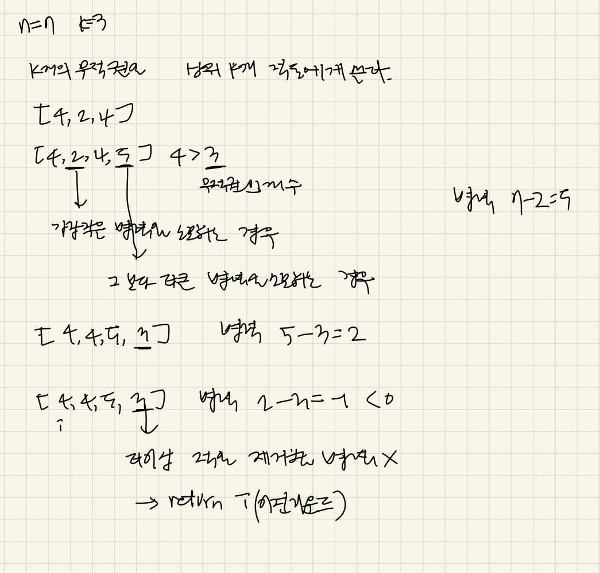

### 문제풀이

k번의 무적권은 '가장 큰 적'에게 쓰는게 최적이므로, 지금까지 나온 적들 중에 k개는 무적, 나머지는 병력n으로 막는 전략 
- min-heap에 '무적권을 쓴 적들'을 담고, 크기가 k를 넘으면, 작은 적들 부터 병력을쓰면서 제거해나감 

> 💡 무작정 **전체 enemy중 상위 k개의 가장 큰 적들에게만 무적권을 쓸 수없는 이유**는,**라운드는 순차적으로 진행**되기 때문이다.  
    - 매 라운드마다 임시로 무적권을 쓴다고 **가정** -> k+1개가 되면 그중 최솟값을 병력으로 지불 = 현재까지의 라운드에서 항상 상위 k개는 무적, 나머지 병력 
    - 큰 적이 병력으로 지불됐다면, 무적권을 큰 적에게, 작은 적에 적은 병력을 쓰도록 둘을 바꾸면됨(remain이 남아있을 때까지) 
    -> 결국 무적권은 항상 '그 시점까지 나온 적 중 상위 k개'에 쓰이게 됨 

### heap의 동작
heap에는 무적권을 쓸 적들을 담는다. 
- 무적권 횟수 k를 초과하면, 작은 적들 부터 제거해나간다. 
- 그러다가 남은 병사들수가 음수가 될때, 이전 라운드 i를 반환 
- 모든 적들을 break없이 순회했다는것은 enmey를 전부 막은 것(`return enemy.length`)

